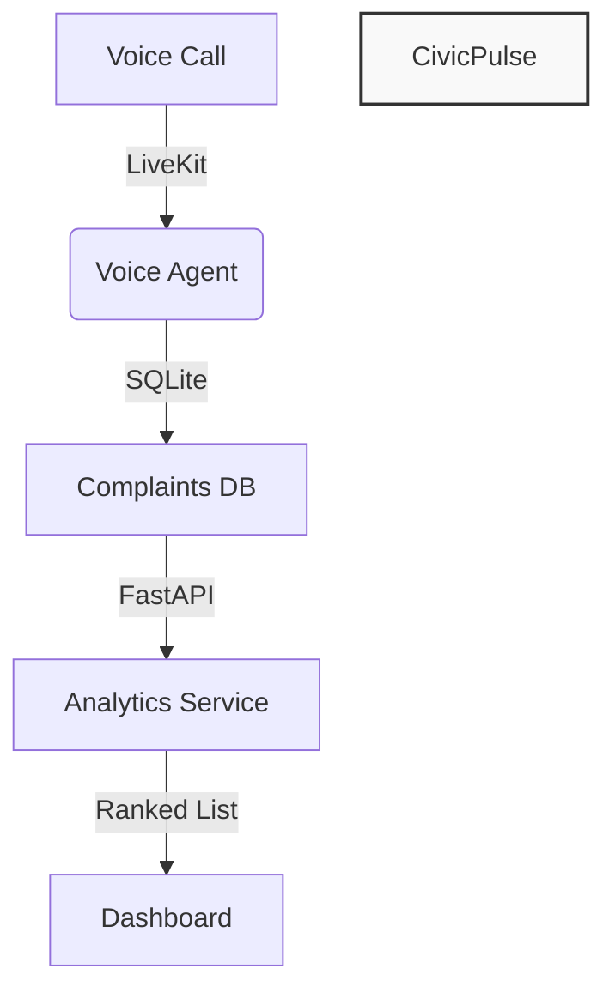

# CivicPulse

CivicPulse is a citizen infrastructure-complaint intake system for BRICS Track 1: AI for Digital Public Infrastructure and Governance. It enables citizens to report infrastructure problems — roads, water, electricity, sanitation — via voice call, and produces a ranked hotspot list for policymakers by district.

**Quickstart with Docker:** `docker compose up`

## What the project does

- Receives real-time voice complaints through a LiveKit voice agent
- Logs complaints (category, location, description, urgency, optional citizen name/contact) into SQLite
- A FastAPI analytics service summarizes and scores complaints per district using Google Gemini (with Groq fallback) and an LLM
- A dashboard page displays the ranked hotspot list by district
- Designed for hackathon demos and scalable DPI deployment

## Architecture



## Components

| Component | Description |
|---|---|
| **Backend (LiveKit voice agent)** | `src/agent.py` — handles speech-to-text (Deepgram), LLM reasoning, text-to-speech (Murf), and logs complaints to SQLite |
| **Analytics Service** | FastAPI app at `analytics/` — reads logged complaints + district dataset, summarizes with Gemini/Groq, produces ranked hotspot list |
| **Database** | SQLite with `complaints` table; synthetic district dataset at `backend/data/district_infra_index.csv` |
| **Frontend** | Next.js app with voice call UI and `/dashboard/hotspots` route showing ranked results |

## Quickstart

1. **Clone and install**

   ```bash
   git clone <your-repo-url>
   cd civicpulse
   python3 -m venv venv
   source venv/bin/activate
   pip install -r requirements.txt
   ```

2. **Configure environment variables**

   Copy `.env.example` to `.env` and set the required keys:

   ```bash
   cp .env.example .env
   ```

   Required environment variables:

   | Variable | Description |
   |---|---|
   | `GEMINI_API_KEY` | Google Gemini API key (required) |
   | `GROQ_API_KEY` | Groq API key (optional; used as fallback if Gemini key is missing) |
   | `ENVIRONMENT` | `development` or `production` |
   | `SECRET_KEY` | Strong random key; required when `ENVIRONMENT=production` |

   ```env
   GEMINI_API_KEY=your-gemini-key
   GROQ_API_KEY=your-groq-key
   ENVIRONMENT=development
   SECRET_KEY=dev-key-not-for-production
   ```

3. **Generate synthetic data and seed the database**

   ```bash
   python3 backend/seed_db.py
   ```

   This inserts 15–20 realistic fake complaints into the SQLite database so the dashboard has data to show without live voice calls.

4. **Start the backend**

   ```bash
   python3 src/agent.py
   ```

   The voice agent will start and listen for LiveKit connections. Complaints are logged to `data/complaints.db`.

5. **Start the analytics service**

   ```bash
   python3 analytics/main.py
   ```

   The FastAPI service reads from the SQLite database and runs the Gemini/Groq summarization pipeline to produce a ranked hotspot list.

6. **Start the frontend**

   ```bash
   cd frontend
   npm install && npm run dev
   ```

   Open the app and navigate to `/dashboard/hotspots` to see the ranked complaint hotspots by district.

## Run tests

```bash
python3 -m pytest tests/ -v
```

## Known limitations

- The Gemini summarization quality depends on the API key being valid and the model being available; if both Gemini and Groq keys are missing, the system falls back to a basic keyword-based summary, which may not produce nuanced rankings.
- The district scoring algorithm uses a synthetic district infrastructure index; real-world deployment would need a validated geographic and infrastructure dataset.
- The voice agent requires LiveKit, Deepgram, and Murf API keys for full functionality; the demo can run with seeded SQLite data alone.
- The analytics service currently processes complaints in memory; very high volumes would require a persistent queue (e.g., Redis) and batch processing.
- The frontend dashboard is a prototype; a production deployment would include authentication, filtering, and export capabilities.

## Deployment

- **Render**: Deploy the backend as a Web Service (Docker), the analytics as a separate service, and the frontend as a Static Site. Set environment variables in the Render dashboard.
- **Vercel**: Deploy the frontend; set GEMINI_API_KEY (and GROQ_API_KEY if desired) as Vercel environment variables.
- **Docker**: Use the provided `Dockerfile` at the repo root for containerized deployment.

See `.env.example` for the complete list of environment variables the project understands.